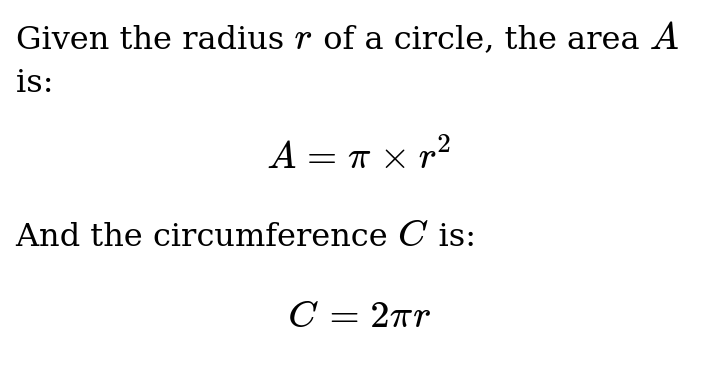

# Goldmark Katex

[](https://pkg.go.dev/github.com/FurqanSoftware/goldmark-katex)

Goldmark Katex is a [Goldmark](https://github.com/yuin/goldmark) extension providing math and equation support through [KaTeX](https://katex.org/).

## Usage

``` go
goldmark.New(goldmark.WithExtensions(&Extender{})).Convert(src, dst)
```

Wrap inline math with a pair of single `$`:

```markdown
$A$
```

Wrap block math with a pair of double `$`:

```markdown
$$
A = \pi \times r^2
$$
```

## Example

<table>
<tr>
<td>

```markdown
Given the radius $r$ of a circle, the area $A$ is:

$$
A = \pi \times r^2
$$

And the circumference $C$ is:

$$
C = 2 \pi r
$$
```

</td>
<td>



</td>
</tr>
</table>

## More Goldmark Extensions

- [D2](https://github.com/FurqanSoftware/goldmark-d2): diagram support through [D2](https://d2lang.com/)
